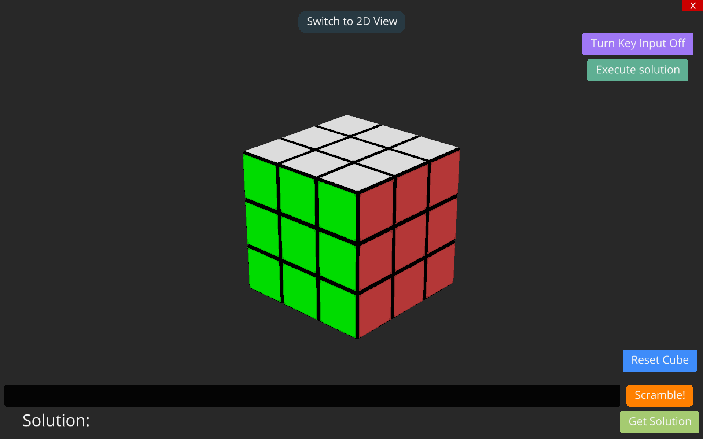
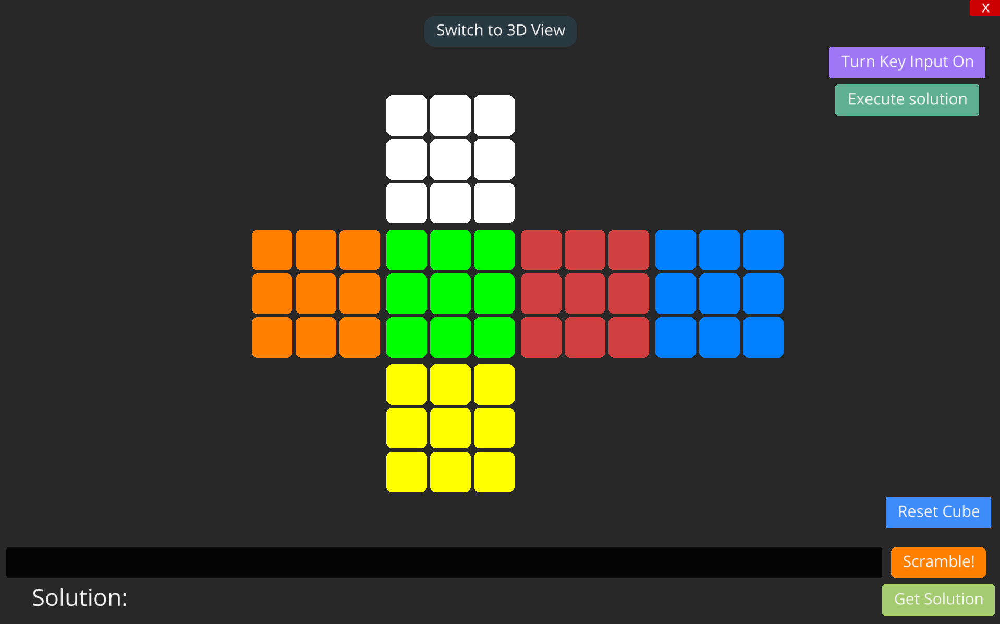
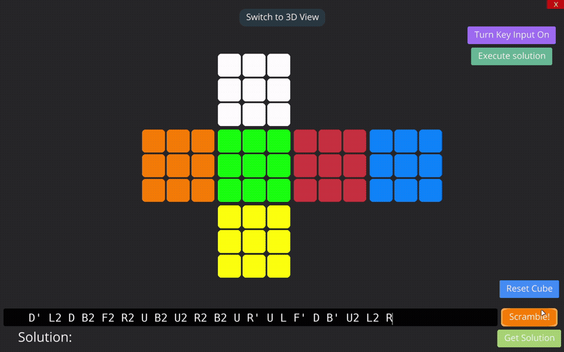
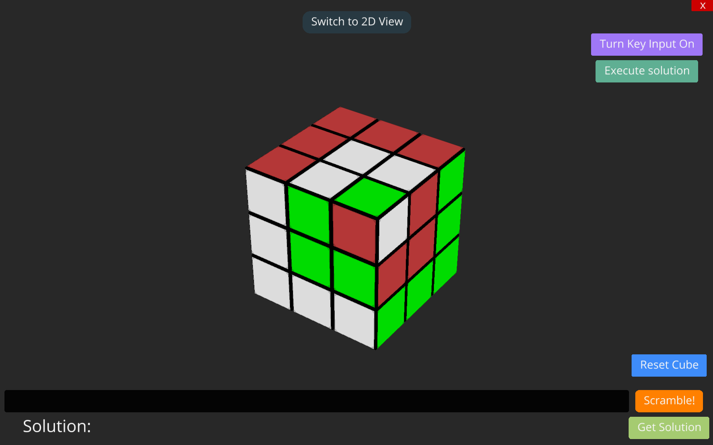

# CubiK 🧩

A 3D Rubik’s Cube visualizer and solver built using Ursina and Python.


## ✨Features:

- Interactive 3D Rubik’s Cube
- 2D cube net editor
- Real-time synchronized cube state
- Animated cube rotations
- Scramble parser
- Kociemba solver integration
- Keyboard move controls
- Animated solution execution

---

## 🕹️ Controls: 

- U → Up
- D → Down
- L→ Left
- R → Right
- F → Front
- B → Back

Hold `Shift` while pressing a key for inverse (prime) moves.

Press `Tab` to switch between 3D and 2D modes

---

## 📥 Installation

```bash
# Clone the repository
git clone https://github.com/Dishen192/CubiK
```

```bash
# Install the required dependencies
pip install -r requirements.txt
```

---

## 🚀 Run:

```bash
# Run the application using:
python main.py
```

---

## ⚙️ Technologies Used

- Python
- Ursina Engine
- Kociemba Solver

---

## 📌 Future Plans

- Timer support
- Better UI polish
- Step-by-step solving mode
- Arduino robot solver integration

---

## 📸 Screenshots

#### 3D Cube


##

#### 2D Cube


##

#### Scramble


##

#### Pattern


---

## 🤝 Contributing
Contributions are welcome! Feel free to open issues or submit pull requests to improve the project.

## 👨‍💻 Author

Dishen Bharadwaj R

## 📋 License
CubiK is released under a [MIT LICENSE](https://github.com/Dishen192/CubiK/blob/main/LICENSE)
